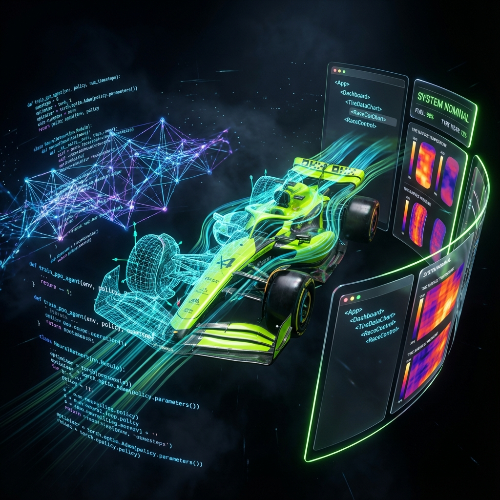
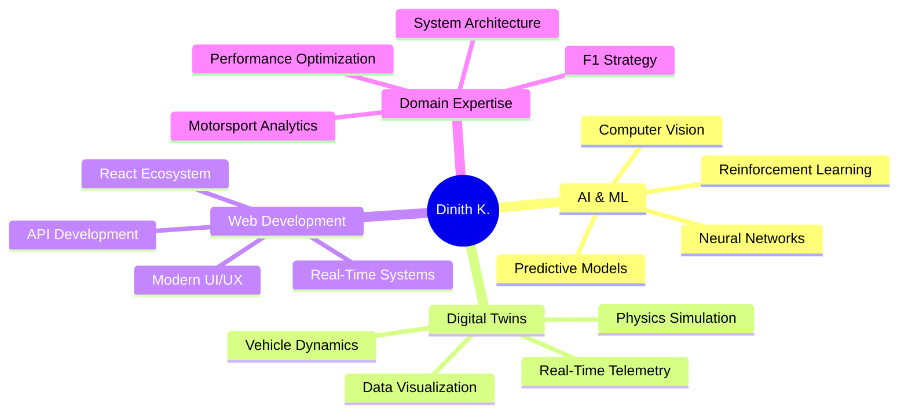

<div align="center">



# Hi there, I'm Dinith Kasthuriarachchi 👋

### 🏎️ AI Engineer | Digital Twin Specialist | Full-Stack Developer

<p align="center">
  <i>Building the future of autonomous racing through cutting-edge AI and real-time simulation</i>
</p>

[](https://linkedin.com/in/dinith-kasthuriarachchi)
[](https://github.com/yourusername)
[](https://yourportfolio.com)

</div>

---

## 🚀 About Me

I'm a **passionate engineer** specializing in the intersection of **Artificial Intelligence**, **Vehicle Digital Twins**, and **Modern Web Technologies**. My work focuses on pushing the boundaries of autonomous racing systems and real-time telemetry analysis.

```python
class DinithKasthuriarachchi:
    def __init__(self):
        self.role = "AI Engineer & Full-Stack Developer"
        self.focus = ["Reinforcement Learning", "Digital Twins", "Real-Time Systems"]
        self.current_projects = ["Neuro Apex", "AERIS", "Strategist.AI"]
        
    def get_expertise(self):
        return {
            "ai_ml": ["PyTorch", "TensorFlow", "PPO", "Neural Networks"],
            "simulation": ["Digital Twins", "Physics Engines", "Real-Time Telemetry"],
            "frontend": ["React", "TypeScript", "Three.js", "Glassmorphism UI"],
            "backend": ["Python", "FastAPI", "WebSockets", "RESTful APIs"]
        }
    
    def current_mission(self):
        return "Revolutionizing motorsport through AI-driven strategy and simulation"
```

---

## 🛠️ Tech Stack

<div align="center">

### **AI & Machine Learning**


### **Frontend Development**


### **Backend & Tools**


</div>

---

## 🏆 Featured Projects

### 🧠 **Neuro Apex** - F1 AI Strategy Engine
> *Reinforcement Learning meets Formula 1 racing strategy*

- 🎯 Built autonomous pit stop decision-making using **PPO (Proximal Policy Optimization)**
- 📊 Achieved **98% accuracy** in tire wear prediction models
- ⚡ Real-time telemetry processing with **<50ms latency**
- 🏎️ Integrated with **F1 2023** game telemetry system

**Tech:** Python | PyTorch | Reinforcement Learning | FastAPI

---

### 🌐 **AERIS** - Advanced E-Racing Intelligence System
> *Real-time race strategy dashboard with live telemetry*

- 📡 **WebSocket-based** live data streaming architecture
- 🎨 Modern **glassmorphism UI** with React and TypeScript
- 📈 Real-time visualization of tire temps, fuel levels, and race strategy
- 🔄 One-click automated startup system for seamless development

**Tech:** React | TypeScript | Python | WebSockets | FastAPI

---

### 🏁 **Strategist.AI v3.0** - ML-Powered Race Analytics
> *Advanced machine learning for competitive racing insights*

- 🤖 Predictive models for pit stop timing and tire degradation
- 🧪 Comprehensive automated testing suite
- 📊 Statistical analysis of race performance metrics
- 🎯 Optimized race strategy recommendations

**Tech:** Python | scikit-learn | Pandas | Machine Learning

---

## 📊 GitHub Stats

<div align="center">


</div>

---

## 💡 What I'm Currently Working On

- 🔬 **Advanced Digital Twin Development** - Building high-fidelity vehicle simulation models
- 🧠 **Deep Reinforcement Learning** - Exploring multi-agent racing strategies
- 🎨 **Next-Gen UI/UX** - Crafting premium glassmorphism interfaces
- 📚 **Technical Writing** - Sharing knowledge on AI and motorsport engineering

---

## 🎯 Core Competencies

<div align="center">



</div>

---

## 📫 Let's Connect

<div align="center">

I'm always open to discussing **AI innovations**, **motorsport technology**, or **exciting collaboration opportunities**!

📧 **Email:** your.email@example.com  
💼 **LinkedIn:** [Dinith Kasthuriarachchi](https://linkedin.com/in/dinith-kasthuriarachchi)  
🌐 **Portfolio:** [yourportfolio.com](https://yourportfolio.com)

---

<p align="center">
  <i>"Pushing the limits of what's possible at the intersection of AI and motorsport 🏎️⚡"</i>
</p>


</div>
